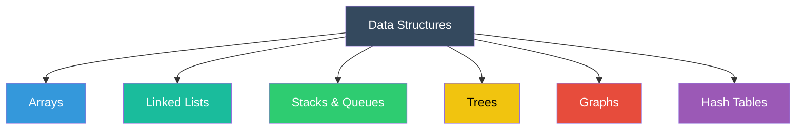
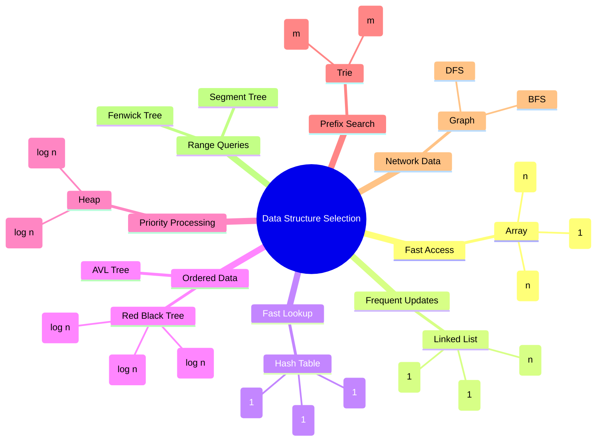

    

        
    

# [Data Structures](https://wikipedia.org/wiki/Data_structure) in [F#](https://github.com/cybersecurity-dev/awesome-fsharp-programming-language)

 

    
    &nbsp;
    
    &nbsp;
    
    

## 📖 Contents
- [Data Structures](#data-structures)
- [My Awesome Lists](#my-awesome-lists)
- [Contributing](#contributing)
- [Contributors](#contributors)

## Data structures
* [List](https://wikipedia.org/wiki/List_(abstract_data_type))
* [Set](https://wikipedia.org/wiki/Set_(abstract_data_type))
* [Multiset](https://wikipedia.org/wiki/Multiset)
* [Map](https://wikipedia.org/wiki/Associative_array)
* [Multimap](https://wikipedia.org/wiki/Multimap)
* [Graph](https://wikipedia.org/wiki/Queue_(abstract_data_type))
* [Tree](https://wikipedia.org/wiki/Tree_(data_structure))
* [Stack](https://wikipedia.org/wiki/Stack_(abstract_data_type))
* [Queue](https://wikipedia.org/wiki/Queue_(abstract_data_type))
* [Priority queue](https://wikipedia.org/wiki/Priority_queue)
* [Double-ended queue](https://wikipedia.org/wiki/Double-ended_queue)
* [Double-ended priority queue](https://wikipedia.org/wiki/Double-ended_priority_queue)

---

| Data Structure | F# Implementation |
|----|:----:|
|[List](https://wikipedia.org/wiki/List_(abstract_data_type))|[source](#)|
|[Set](https://wikipedia.org/wiki/Set_(abstract_data_type))|[source](#)|
|[Multiset](https://wikipedia.org/wiki/Multiset)|[source](#)|
|[Map](https://wikipedia.org/wiki/Associative_array)|[source](#)|
|[Multimap](https://wikipedia.org/wiki/Multimap)|[source](#)|
|[Graph](https://wikipedia.org/wiki/Queue_(abstract_data_type))|[source](#)|
|[Tree](https://wikipedia.org/wiki/Tree_(data_structure))|[source](#)|
|[Stack](https://wikipedia.org/wiki/Stack_(abstract_data_type))|[source](#)|
|[Queue](https://wikipedia.org/wiki/Queue_(abstract_data_type))|[source](#)|
|[Priority queue](https://wikipedia.org/wiki/Priority_queue)|[source](#)|
|[Double-ended queue](https://wikipedia.org/wiki/Double-ended_queue)|[source](#)|
|[Double-ended priority queue](https://wikipedia.org/wiki/Double-ended_priority_queue)|[source](#)|

##

### My Awesome Lists
You can access the my awesome lists [here](https://cyberthreatdefence.com/my_awesome_lists)

### Contributing
[Contributions of any kind welcome, just follow the guidelines](contributing.md)!

### Contributors
[Thanks goes to these contributors](https://github.com/cybersecurity-dev/data-structures-in-fsharp/graphs/contributors)!

[🔼 Back to top](#data-structures-in-f)
